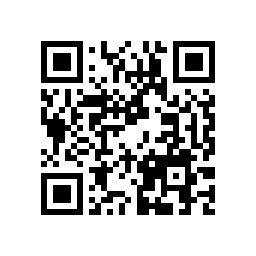

# FaaS qrcode

[](https://goreportcard.com/report/github.com/faas-and-furious/qrcode) [](https://microbadger.com/images/faasandfurious/qrcode "Get your own image badge on microbadger.com")

This repo contains an example [FaaS](https://github.com/alexellis/faas) function which uses the [skip2/go-qrcode](https://github.com/skip2/go-qrcode) Go library to generate a QR Code for a string.

## Deploying the Function

Make sure you have deployed a FaaS stack to your cluster using the instructions on the [FaaS repo](https://github.com/alexellis/faas).

### Use the CLI (`faas-cli`)

**Get the CLI**

The [faas-cli](https://github.com/alexellis/faas-cli/) can be installed via `brew install faas-cli` or `curl -sSL https://get.openfaas.com | sudo sh`.

Now deploy the function as follows:

```
# faas-cli -action deploy -image=faasandfurious/qrcode -name=qrcode -fprocess="/usr/bin/qrcode"
200 OK
URL: http://localhost:8080/function/qrcode
```

### Testing the Function
Now that the function is running in your FaaS environment you can test it from the command line by running:

```
$ curl localhost:8080/function/qrcode --data "https://github.com/alexellis/faas" > qrcode.png
```



You can check the QR code works using your phone, or an online QR Code decoder ([ZXing Decoder Online](https://zxing.org/w/decode.jspx) for example)
